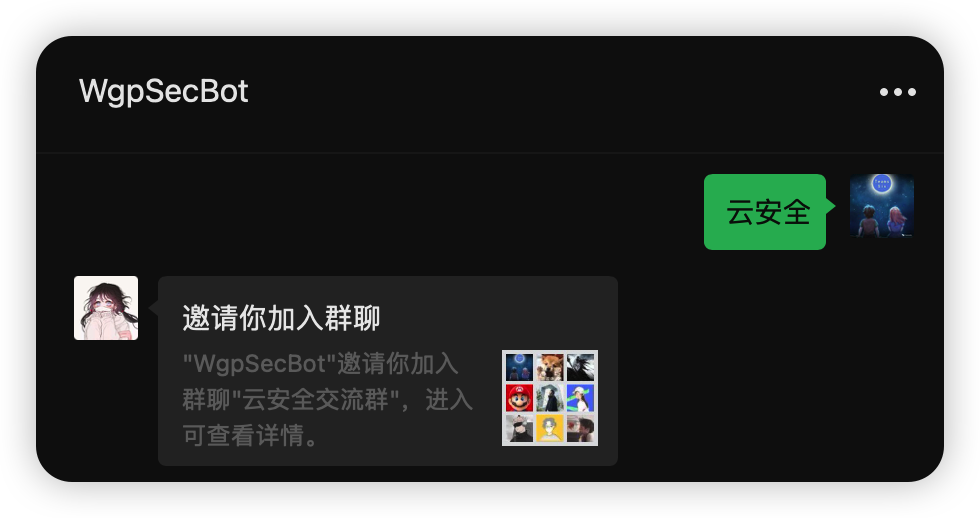

# Awesome Cloud Security 云安全资源汇总

  
# 0x01 资料

## 1 综合类

* 国内首个云安全社区 —— 火线 Zone 云安全社区 :fire: [地址](https://zone.huoxian.cn/?sort=newest)
* 可能是国内首个云安全知识文库？ —— T Wiki 云安全知识文库 :fire: [地址](https://wiki.teamssix.com/) `笔者自己搭建的知识库，大力推荐` :+1:
* Hacking The Cloud（英文） [地址](https://hackingthe.cloud/)
* Lightspin Blog（英文）[地址](https://blog.lightspin.io/)
* Sysdig 云安全报告（英文）[地址](https://sysdig.com/resources/reports/)
* 云安全资源汇总 awesome-cloud-security :fire: [地址](https://github.com/teamssix/awesome-cloud-security)  `其实就是本项目`:hear_no_evil:
* awesome-cloud-native-security from pen4uin [地址](https://github.com/pen4uin/awesome-cloud-native-security) 
* awesome-cloud-native-security from Metarget [地址](https://github.com/Metarget/awesome-cloud-native-security) 

## 2 云服务

* AWS S3 对象存储攻防 :fire: [地址](https://zone.huoxian.cn/d/907-aws-s3)
* AWS EC2 弹性计算服务攻防 [地址](https://zone.huoxian.cn/d/1022-aws-ec2)
* 阿里云 OSS 对象存储攻防 :fire: [地址](https://zone.huoxian.cn/d/918-oss)
* 阿里云 ECS 攻防 [地址](https://zone.huoxian.cn/d/1064-ecs)
* 腾讯云 COS 对象存储攻防 [地址](https://zone.huoxian.cn/d/949-cos)
* 腾讯云服务器攻防（CVM+轻量应用服务器）[地址](https://zone.huoxian.cn/d/1028-cvm)
* 华为云 OBS 对象存储攻防 [地址](https://zone.huoxian.cn/d/962-obs)
* 华为云 ECS 弹性云服务器攻防 [地址](https://zone.huoxian.cn/d/1074-ecs)
* 谷歌云 对象存储攻防 [地址](https://zone.huoxian.cn/d/931)
* 谷歌云 Compute Engine 攻防 [地址](https://zone.huoxian.cn/d/1043-compute-engine)
* 微软云 对象存储攻防 [地址](https://zone.huoxian.cn/d/940)
* 微软云 VM 攻防 [地址](https://zone.huoxian.cn/d/1083-vm)
* 浅谈云上攻防——云服务器攻防矩阵 :fire: [地址](https://cloud.tencent.com/developer/article/1931560)
* 针对 AWS Lambda 的运行时攻击 [地址](https://mp.weixin.qq.com/s/duF1Z0EDC3n_G378Aq_XYA)
* 浅谈云上攻防——对象存储服务访问策略评估机制研究 [地址](https://mp.weixin.qq.com/s/ncWGrMsIAvh9HEK1QC5IGQ)
* 红队视角下的公有云基础组件安全 [地址](https://mp.weixin.qq.com/s/r0DuASP6gH_48b5sJ1DCTw)
* 红队视角下的公有云基础组件安全（二）[地址](https://mp.weixin.qq.com/s/lL32lywlrnuyhJkQk5NAEw)
* 利用 AWS RDS 读取实例凭证（英文）[地址](https://blog.lightspin.io/aws-rds-critical-security-vulnerability)
* 利用 AWS RDS 读取实例凭证（中文翻译）[地址](https://mp.weixin.qq.com/s/q447kIZoHZ1SdUpZi4D5SQ)
* 风险最高的10种AWS配置错误 [地址](https://mp.weixin.qq.com/s/quIpapbkFNay0JtUK4wODQ) 

## 3 云原生

* 特权模式下 Docker 逃逸手法总结 :fire: [地址](https://zone.huoxian.cn/d/1071-docker)
* 容器逃逸方法检测指北（附检测脚本）[地址](https://zone.huoxian.cn/d/990)
* Terraform 中文教程 :fire: [地址](https://lonegunmanb.github.io/introduction-terraform/)
* 利用gateway-api，我支配了kubernetes [地址](https://mp.weixin.qq.com/s/Y4F72s0JSyvjLBN3iNyUZg)
* 红蓝对抗中的云原生漏洞挖掘及利用实录 [地址](https://security.tencent.com/index.php/blog/msg/183)

## 4 公众号

* 火线 Zone :fire: 
* TeamsSix
* 云鼎实验室
* 绿盟科技研究通讯
* 默安逐日实验室

## 5 书籍

《云原生安全-攻防实践与体系构建》:fire: 

# 0x02 工具

## 1 云服务

### 辅助工具

* 在线搜索目标网站下的 AWS 资产 recon.cloud [地址](https://recon.cloud/)
* 在线搜索公开的 S3 存储桶 buckets.grayhatwarfare.com [地址](https://buckets.grayhatwarfare.com/)
* 在线多云管理平台 行云管家 [地址](https://www.cloudbility.com/) `由「半人间丶」师傅补充，感谢支持`
* 多云基线扫描工具 ScoutSuite [地址](https://github.com/nccgroup/ScoutSuite) 
* 阿里云官方 OSS 浏览工具 [地址](https://github.com/aliyun/oss-browser)  `由「半人间丶」师傅补充，感谢支持`
* S3 策略扫描工具 S3Scanner [地址](https://github.com/sa7mon/S3Scanner) 
* 云存储管理客户端 qiniuClient [地址](https://github.com/willnewii/qiniuClient)  `由「半人间丶」师傅补充，感谢支持`
* 云服务资源枚举工具 cloud_enum [地址](https://github.com/initstring/cloud_enum) 
* 多云对象存储扫描工具 Cloud-Bucket-Leak-Detection-Tools [地址](https://github.com/UzJu/Cloud-Bucket-Leak-Detection-Tools) 

### 利用工具

* AWS 综合利用工具 pacu [地址](https://github.com/RhinoSecurityLabs/pacu) 
* 阿里云 AccessKey 利用工具 aliyun-accesskey-Tools [地址](https://github.com/mrknow001/aliyun-accesskey-Tools)  `由「半人间丶」师傅补充，感谢支持`
* 阿里云 ECS、策略组辅助小工具 alicloud-tools [地址](https://github.com/iiiusky/alicloud-tools)  `由「半人间丶」师傅补充，感谢支持`
* 阿里云 AccessKey 泄漏利用工具 AliyunAccessKeyTools [地址](https://github.com/NS-Sp4ce/AliyunAccessKeyTools)  `由「半人间丶」师傅补充，感谢支持`
* AWS 云平台 AccessKey 泄漏利用工具 awsKeyTools [地址](https://github.com/Aabyss-Team/awsKeyTools)   `由「1derian」和「ShangRui-hash」师傅联合补充，感谢支持`
* 腾讯云 AccessKey 利用工具 Tencent_Yun_tools [地址](https://github.com/freeFV/Tencent_Yun_tools)

## 2 云原生

### 辅助工具

* 容器逃逸检测工具 container-escape-check :fire: [地址](https://github.com/teamssix/container-escape-check) `自己写的工具，表哥速来 Star`:star2:

### 利用工具

* 容器渗透工具集 CDK [地址](https://github.com/cdk-team/CDK) 
* 容器安全工具集 veinmind-tools [地址](https://github.com/chaitin/veinmind-tools) 

# 0x03 靶场

* 在线收费的包含云安全实验的靶场 Attack Defense [地址](https://attackdefense.pentesteracademy.com/listing?labtype=cloud-services&subtype=cloud-services-amazon-s3)
* AWS 靶场部署工具 cloudgoat [地址](https://github.com/RhinoSecurityLabs/cloudgoat) 
* 云原生靶场部署工具 metarget :fire: [地址](https://github.com/Metarget/metarget) 

# 云安全交流群

> 如果群满了，不会有二群，只创这一个群，对于群里不活跃的或者发布恶意广告的会踢出。

如果群二维码失效了，可以添加 WgpSecBot 微信，搜索微信号 WgpSecBot 或扫描以下二维码可以添加它，添加后发送`云安全`就可以进群了

    

   

如果想加入`狼组安全团队交流群`，可以直接和 WgpSecBot 说`加群`，WgpSecBot  就会把你拉到狼组交流群了。
